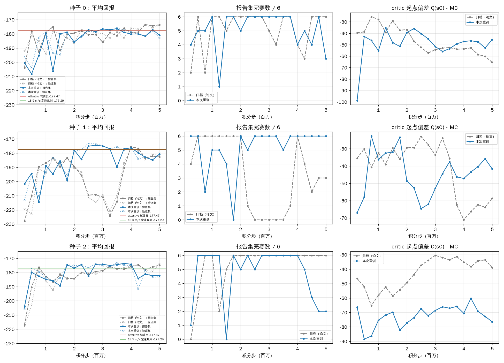

# evcRL：TIV v19 长程环境感知 TD3 的复现、核对、训练调试与视觉 Z 接入

本仓库针对论文《Energy Efficiency Optimization of Electric Vehicles with Environment-Aware Reinforcement Learning: Value, Control, and Smooth Execution》（TIV v19）的**20 km 长程环境感知 TD3** 主实验，给出可一键执行的复现流程、逐项的论文↔代码核对、本次实际运行得到的复现结果、发现的复现障碍及其处理，以及对训练行为（先升后降、critic 偏差）的调试诊断。所有说明为中文；所有结论都来自本目录中实际执行过的脚本与保存的输出。

> 一句话结论：论文长程实验的**代码与论文陈述逐项一致**；论文 Table II/III/S1–S4/F1 及 8 个选中检查点的 12 工况评估**可在本环境中精确复现（误差 0）**；但**跨 torch/numpy 版本重新训练不是位一致的**，重训只能得到同一协议下的新样本，不能期望逐种子重现论文数字。真正阻塞复现的是两处工程问题（发布目录布局与 `evaluate_checkpoint.py` 不匹配；短程研究的断点加载硬校验运行时版本），本目录已给出绕过脚本并验证。

## 1. 目录内容

| 路径 | 内容 |
|---|---|
| `evsim_v9/` | 冻结的 20 km 模拟器与 TD3 训练器，从 `long_route/code_evsim_v9.tgz` 原样解出（SHA-256 见 `reference/code_evsim_v9.tgz.sha256`），未修改任何源码 |
| `reference/` | 论文八种子归档：`bench_curves/`（8 条训练曲线，每条 20 个检查点的 12 工况网格）、`bench_results.json`（验证集选点结果）、`refs_fixed.json`（DP/驾驶员/定速参考）、`cruise_baseline.json`、`recomputed_v17.json`、`selected_checkpoints/`（8 个验证集选中的检查点权重） |
| `scripts/` | 复现脚本（中文注释与提示），见第 2 节 |
| `results/` | 本次会话实际运行产生的记录：门禁输出、烟测、检查点回放、屏蔽响应、Table F1 诊断、短程 actor 复现、重训曲线与对比 |
| `docs/paper_code_audit.md` | 论文 ↔ 代码逐项核对表（模型、奖励、观测、执行层、TD3 超参数、评估协议）及踩坑清单 |
| `visual_z_framework/` | 用户交付的视觉编码 Z 交接框架（原样保留；本次仅运行其 11 项契约测试并核对 v19 源码哈希与真实 actor 迁移，均通过） |

## 2. 环境与一键运行

依赖：Python ≥ 3.10（本次 3.11.15），numpy（本次 2.4.6），torch CPU（本次 2.14.0+cu130，未使用 CUDA），scipy 仅短程执行层测试需要。训练与评估全程单线程 CPU；不要使用 GPU（64 单元 MLP，环境积分是瓶颈）。

```bash
cd tiv_long_horizon_repro
bash scripts/run_gates.sh                     # 门禁：check_env / verify.py 六项 / 8 项回归 / 视觉框架 11 项测试
bash scripts/smoke_bit_identity.sh            # 12k 步位一致烟测（期望 R=-387.723，last-3=-394.262）
python3 scripts/replay_selected_checkpoints.py # 论文 8 个选中检查点回放，网格误差应为 0
python3 scripts/channel_masks.py              # Table S3 selected 三列（环境感知通道屏蔽响应）
python3 scripts/diagnose_curves.py            # 归档 8 条曲线的逐检查点诊断表
SEEDS="0 1 2" JOBS=3 bash scripts/train_repro.sh   # 按冻结协议重训（500 万步/种子，4 核约 3 小时）
python3 scripts/compare_curves.py             # 重训曲线 vs 归档曲线逐检查点比较 + 论文选点规则计分
TIV_BASE=/path/TIV_v19_Reproducibility python3 scripts/short_route_frozen_actor.py  # 短程研究 actor 提取与复现
```

`scripts/train_repro.sh` 的 `TAG` 不能与 `evsim_v9/out/` 中已有运行重名（`run_batch.py` 拒绝覆盖）。

## 3. 论文思想在代码中的落点（长程主实验）

- **环境感知（structured environment awareness）**：策略输入是 13 维结构化观测（`env20.py obs()`）：车速、上一实际加速度、剩余距离、当前限速、400 m 内弯道距离/限速、1000 m 内信号距离/相位/剩余相位时间、SOC、电池温度、剩余任务时间、已用时间。信号信息只在 1000 m 广播范围内可见（SPaT 边界），范围外只给距离；这是论文“环境感知不是视觉编码器”的实现含义。
- **任务目标**：L 型奖励 r = −P_b Δt/E0 − λ_T Δt − 超速项（`env20.py step()`），λ_T=0.08 等价于 8 kW 的时间影子价格，与 DP 参考的 Lagrangian 一致；未完成距离按 15 单位/km 收费，1312.5 s 截止为真实终止。
- **执行层（式 (3)）**：`env20.py project()`：jerk 裁剪 → 执行器箱 → 安全上限 a_safe → 非负速度。安全上限保证不闯红灯与终点停车；弯道由包络处理。
- **学习器**：TD3 双 critic、延迟 actor、目标动作噪声，加上 **20 个决策的无折扣行为回报多步目标**（`td3_run.py` 第 246–258 行滑动窗口），FIFO 125000 决策转移，OU 探索，85% 路内探索起点。
- **评估协议**：12 工况（三组电池 × 4 个信号偏移），偏移 {0,45} 选检查点、{22.5,67.5} 报告；末 8 检查点均值为 late；参考为 DP 跟踪轨迹、三种驾驶员、18.5 m/s 定速规则。

完整的逐项核对见 `docs/paper_code_audit.md`。

## 4. 本次实际复现结果

| 检查 | 结果 | 记录 |
|---|---|---|
| 三道门禁（verify.py 六项、8 项回归、视觉框架 11 项） | 全部通过 | `results/gates.txt` |
| 12k 步 seed 0 烟测 | R=−387.723、last-3=−394.262，与冻结 README 位一致（需 `--log 6000`） | `results/smoke/` |
| 8 个验证集选中检查点回放 | 12 工况网格与训练日志最大 \|ΔR\| = 0.0，报告集分数与 `bench_results.json` 一致（Table III） | `results/replay/` |
| Table II/III/S1/S2/S4 重算 | `analysis_metrics.py` 输出与保留的 `recomputed_v17.json` 704 个数值全部一致 | 见 docs 第 5 节 |
| Table S3 屏蔽响应 selected 列 | 8 个种子的 (电池, SPaT, 弯道) 三元组与论文完全一致 | `results/channel_masks_selected.json` |
| Table S3 late 列 | 与归档 `channel_late8.json` 逐值一致 | `results/channel_late8_regenerated.json` |
| Table F1 网络斜率诊断 | 与归档共有键逐值一致 | `results/critic_gradient2_regenerated.json` |
| 论文 v19 自带审计 `audit_v19.py` | 398 项旧数值比对 + 650 项新检查全部通过 | `results/audit_v19_rerun.json` |
| 短程研究 A/B actor 九工况评估（附录 J-C 的 77.861 / 49.083） | 18 条行程逐工况 I_j 误差 0.0；A 的张量与 SPaT 包 `actor_A.pt` 完全一致 | `results/short_route/` |
| 按冻结协议重训 seeds 0/1/2 × 500 万步 | 三种子选点报告集 R −176.34/−175.09/−174.55（均 6/6，均优于 attentive 与定速规则）；late −179.05/−181.02/−178.42；先升后降全部重现 | `results/train/` |

## 5. 发现的复现问题与处理

1. **发布目录布局与 `evaluate_checkpoint.py` 不匹配**：该脚本要求 `<tag>_s<seed>.json` 与检查点同目录，而发布包把权重与曲线分开存放，直接调用抛 `FileNotFoundError`。处理：`scripts/replay_selected_checkpoints.py` 显式配对并做同样的 1e-6 一致性断言；已验证 8/8 通过。
2. **短程舒适性研究断点加载硬校验运行时**：`study.py Trainer.load` 要求 torch/numpy 版本与断点内记录（2.8.0+cpu / 2.3.5）逐字相同，否则 `ValueError('runtime mismatch')`；`TIV_comfort_v2/code/rollout_layer.py` 也只为取 actor 而调用它，导致 Table IV 的评估脚本在其它版本上完全无法运行。处理：`scripts/short_route_frozen_actor.py` 仅提取 actor 六个张量（与 SPaT 实验做法一致），校验源码哈希，并用原 `study.rollout` 复现 A/B 的九个开发工况：逐工况 I_j 误差为 0。这不是修改冻结代码，而是提供不依赖运行时相等的评估入口；真正“精确续训”仍需相同运行时。
3. **跨版本重训不位一致**：12k 步位一致，但第一个 25 万步检查点已分叉（seed 0：归档记录步 250001 / 12 工况 R −198.07，本次 250000 / −198.34）。原因是长时间训练对浮点微小差异（不同 torch 版本的 GEMM/优化器内核）呈混沌放大。结论：论文逐种子数字只能通过检查点回放精确复现；重训是同协议的新样本，评价标准应是“验证集选点后的报告集分数是否落在论文报告的种子分布内”，见第 6 节。
4. **烟测 last-3 依赖记录间隔**：README 中 −394.262 仅在 `--log 6000` 下成立；其它间隔末检查点 R 仍为 −387.723。已在 `scripts/smoke_bit_identity.sh` 固定。
5. **`long_route/data/refs_fixed.json` 指纹与冻结代码不同**（b72133bb… vs 04500faf…）：这是后期带 `K_FRIC/W_EVENT` 训练旋钮版本的“重盖章”副本，1861 个数值与 `evsim_v9/frozen/refs_fixed.json` 完全一致；训练器只读 frozen/ 下的文件，不要互相覆盖。
6. **依赖缺口**：`TIV_comfort_v2/code/test_layer.py` 需要 scipy；`EVSIM_ROUTE` 若被 `study.py` 设为 `mini` 会把 20 km 环境切成 4 km（所有长程脚本先 `unset`）；受限网络下 PyTorch CPU 索引不可达时 PyPI 的 cu130 轮子同样可用（代码不触碰 CUDA）。

## 6. 本次重训结果（seeds 0/1/2，冻结协议，500 万步）

运行：`SEEDS="0 1 2" JOBS=3 STEPS=5000000 TAG=repro`，3 进程并行于 4 核 CPU（torch 2.14.0 / numpy 2.4.6），每种子 20 个检查点；曲线、日志、`analyze.py` 选点结果与三个验证集选中检查点的权重均在 `results/train/`。按论文协议：仅用验证偏移 {0,45} 选检查点，用报告偏移 {22.5,67.5} 计分；late 为末 8 检查点报告集均值（样本 SD）。工况匹配的参考：attentive 驾驶员 −177.473，18.5 m/s 定速规则 −177.290。

| 种子 | 本次选中步 | 本次报告集 R | 完赛 | 本次 late-8 均值 (SD) | 论文选中步 | 论文报告集 R | 耗时/分 |
|---|---|---|---|---|---|---|---|
| s0 | 3500002 | -176.342 | 6/6 | -179.050 (2.00) | 4500000 | -173.490 | 117 |
| s1 | 2500003 | -175.093 | 6/6 | -181.017 (4.68) | 4000002 | -175.468 | 119 |
| s2 | 3500000 | -174.550 | 6/6 | -178.416 (4.44) | 5000000 | -174.936 | 119 |

- **选点成绩**：三个种子的验证集选中检查点都以 6/6 完赛并同时超过 attentive 与定速规则（三种子均值 -175.33，SD 0.92）；论文八种子的选点均值为 −177.37（SD 3.31），其中 5/8 超过规则。本次三个种子都落在论文报告的种子分布之内（论文最好 −173.49，最差 −181.74）。
- **late 成绩**：三个种子末 8 检查点均值 -179.49（SD 1.36），没有一个超过定速规则；论文 late 均值 −183.15（SD 5.75），2/8 超过规则。本次 seed 1 的 late（−181.02）明显好于论文 seed 1（−191.12），因为论文 seed 1 在 225 万–375 万步之间经历了 0/6 完赛的塌陷，而本次 seed 1 在 175 万步塌陷一次（0/6）后恢复；这正是跨版本不位一致后“同协议不同样本”的表现。
- **逐检查点不重合**：`compare_curves.py` 的 Δ报告R 列在 −31 到 +47 之间摆动，选中步也不同（本次 350 万/250 万/350 万步，论文 450 万/400 万/500 万步）。因此不能用“某个检查点的数字对不上”来判断代码有错；能判断代码正确的是第 4 节的回放与重算（误差 0）。
- **先升后降在三个种子上全部重现**（图 `results/train/curves_vs_archived.png`，诊断表 `results/train/curve_diagnostics_repro.md`）：验证集峰值在 250 万–350 万步，其后报告集分数回落 3–7 个单位、完赛数出现 2–5/6 的波动；critic 起点偏差 Q(s0)−MC 全程在 −35 到 −99 之间，seed 2 尤其悲观（−60 到 −89）却在 175 万–400 万步之间连续 6/6 完赛，再次说明偏差量本身不决定驾驶成绩。



结论：在本环境重新训练得到的是**与论文同一协议、同一结论结构**（验证集选点有增益，late 无平均优势，先升后降，critic 系统性低估）的独立样本；论文逐种子数字的精确复现只能通过归档检查点回放完成（第 4 节）。

## 7. 训练调试诊断：为什么会“先升后降”

从归档 8 条曲线（`results/curve_diagnostics_archived.md`）与本次重训曲线（`results/train/curve_diagnostics_repro.md`）中可以直接读出以下事实，它们与论文 VII-C 及冻结包 README “未修复项”一致：

- **验证集峰值位置在 250 万–500 万步间随种子漂移**，峰值后报告集分数回落 2–10 个单位；这就是论文采用“20 个检查点 + 验证集选点”而不是“训练到收敛”的原因。
- **critic 在起点状态系统性低估**：Q(s0) − MC 从 −25 左右逐步扩大到 −50 至 −95（seed 3 达 −96.6）。本次用冻结包自带的 n-step 探针（`probe_nstep_bias.py`，把 19 个后续决策换成含 OU 噪声的行为动作、尾部用真实回放而非 critic）测 seed 0 选中 actor（450 万步）：五个起点的噪声 20 步目标相对无噪声真实回报只偏移 −0.2 到 −1.8（`results/nstep_probe_s0_selected.json`；冻结包 DEBUG_REPORT 在 30 万步模型上测得约 −9）。因此该检查点 −58.6 的偏差主要不是多步行为回报污染，而是通过 min(Q1′,Q2′) 与目标动作噪声反复 bootstrap 累积的悲观误差加函数逼近误差。偏差本身不直接决定驾驶成绩（seed 2 偏差 −30 至 −65 却全程完赛），但它随训练增大，与后期退化同步。
- **回放池构成与完赛率耦合**：`buf_arrived` 低于约 0.4 时（seed 1 的 250 万–375 万步、seed 6 的 400 万步后），报告集完赛数掉到 0–3；池内几乎全是超时 episode 时，critic 看不到完整行程的价值结构，巡航速度滑到 15.24 m/s 的到达阈值以下（`cruise_v` 12–13 m/s），形成 README 所述的“bootstrap 洞”。
- **训练脚本没有实现错误**：n-step 队列、终止标志、目标公式、延迟更新、Polyak 更新、探索与回放均与论文一致（docs 第 4 节）；冻结包 README 列出的负结果消融（整形、priming、γ<1、放宽截止、Retrace）本次未重复，也不应重复。

因此“准确复现论文思想”的正确表述是：论文报告的是**验证集选点后的成绩与 late 均值的分离**、以及跨种子无稳定平均优势；任何重训都应按同一协议报告 selected 与 late 两个数，而不是取最好一次。

## 8. 视觉编码 Z 框架：已按交接文档接入并运行（`TIV_visual_development/`）

本目录第 1–7 节是论文正文长程实验的核对与重训。用户交付的三份文档（设计、Codex 任务、框架骨架）要求的是另一件事：把摄像头图像编码 Z 接进 TD3、由 critic 反馈训练编码器，并与平滑执行层一起进入训练。这部分在 `TIV_visual_development/` 完成，当前报告为 `TIV_visual_development/reports/REPORT_zh.md`（v2，按独立审计 `TIV_Visual_Experiment_Audit_v1.md` 修复后重跑；v1 归档为 `REPORT_v1_zh.md`），要点：

- 同步只读程序化渲染器（v19 无 RGB 传感器，本机无 3D 引擎）：由原环境位姿与同一时刻信号相位驱动，2 Hz、96×160，逐 episode 随机光照/雾/噪声/遮挡；灯箱位于停止线远侧 14 m；真值只进标签。
- 训练环境执行层换成 comfort_v2 r2 的完整 jerk 可行执行层（环境感知 + 动作平滑一起进入训练），信息访问三臂相同，执行层独立性为实测审计项。
- 按审计修复：框标签“格内偏移 + 归一化尺寸”参数化（可表示性 0 违例）、空 ROI 强制 unknown、`association_valid` 与地图关联/ROI 分开、`signal_z` 头使视觉监督训练到 Z 末端、源码/数据/权重哈希进入断点、权重与固定审计样本入库。对抗式代码审查（3 视角 + 逐条反驳核验）又修了检测链路：热图焦点损失按正样本归一化 + 先验偏置 π=0.01、检测评估口径（格一致率/中心误差/≤2 px 命中/阈值召回/误检率）、格分配规则受控对比后固定 floor、事件注意力对热图 detach；受控探针结果在 `runs/probes/`。
- 分级门禁 `runs/run_v2_gated.sh`：门 1 预训练（≤2 px 命中 0.846、格一致 0.754、ROI 已知 0.951、Z 已知 0.973）→ 门 2 审计 19/19 → 门 3 共同适配 + 联合臂烟测 → 门 4 三臂 9000 子步。
- 第二轮专家复核指出两处评估随机数问题（九工况共用相机生成器导致外观随轨迹长度漂移；换图检查第一对外观不同），已修并用三臂已导出权重重新评估（`visual_dev/reevaluate.py`），未重训。
- 三臂小规模结论（单种子，公平评估）：三臂均 9/9 静止完赛、0 违规；ROI 头行驶中已知类 ≥0.975，Z 探针 0.925–0.950；actor 对图像的依赖只有联合臂明显（同状态换图 |Δu| 0.37 vs 冻结 0.03、监督 0.08），且只有联合臂的响应能穿过执行层（投影后 |Δa| 0.38 vs 0/0）；但联合臂没有性能改善（I_j +25.6 即 +44%，9 工况全部更差，时间 +1.4 s，能耗 +1.3 Wh，R −0.16），换图响应方向与真值相位无关。执行层仍读取真值信号并主导实际动作（三臂实际动作分布相同，名义限制占 86–93%），`lambda_c=0`。可写进论文的表述：TD 反馈能够进入视觉编码器并伴随更强的灯色相关指令响应；当前单种子开发实验尚未建立驾驶性能、舒适性或训练效率的改善。下一步是公平比较与作用归因（执行层信息接口改为感知输出、加 `lambda_c>0` 臂、多种子），不是扩大规模。
- 一键：`cd TIV_visual_development && STOP_BEFORE_ARMS=1 bash runs/run_v2_gated.sh pilot_v2`（门 1–3），通过后 `bash runs/run_pilot.sh pilot_v2 9000`；重评估 `python3 visual_dev/reevaluate.py --tag pilot_v2`；汇总 `python3 visual_dev/summarize_pilot.py --tag pilot_v2`。

### 8.1 交接包原状态（接入前）

`visual_z_framework/` 的 11 项契约测试在本环境全部通过（含 `TIV_BASE` 下的 v19 四个源码哈希核对与真实 actor 权重迁移）。它是接口原型：无摄像头渲染器、无预训练骨干、无视觉数据，`SceneCameraNotConnected.capture` 明确抛出 `NotImplementedError`。因此本次**没有也不能**启动 F/S/J 三臂视觉训练；v19 环境本身没有 RGB 传感器，接入需先按交接文档实现同步只读渲染器。该框架对原 13 维观测的处理（屏蔽真值灯色/倒计时通道 7、8，保留上一实际加速度通道 1）与本目录核对的观测定义一致。

## 9. 建议的下一步

1. 若目标是**精确复现论文数字**：只需第 4 节前 9 行的流程，不需要重训。
2. 若目标是**在同一协议下增加种子**：用 `scripts/train_repro.sh` 换 `SEEDS/TAG`，每种子 4 核约 100 分钟；用 `compare_curves.py` 按论文规则计分并与 `bench_results.json` 的种子分布比较。
3. 若目标是**改善后期退化**：先在小规模（≤100 万步、固定种子对照）验证，候选方向为带重要性修正或截断的多步目标、按完赛分层的回放采样（`--balance` 已实现但未在正式协议使用）；冻结包 README 第 5 节列出的负结果不要重跑。
4. 视觉分支：先做公平比较与作用归因——执行层的信号信息接口改为感知输出、同一执行层下加 `lambda_c>0` 臂、多种子（`TIV_visual_development/reports/REPORT_zh.md` 第 8 节）；检测几何/尺寸修正为可选，不是前置条件。
