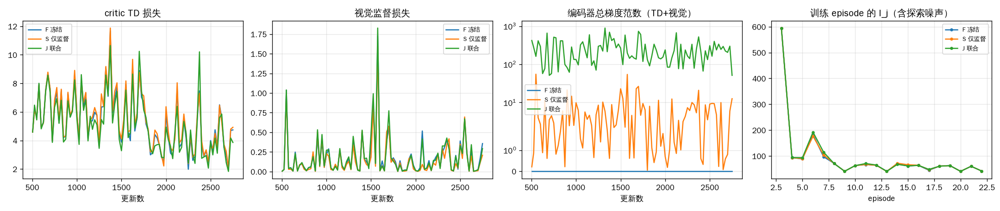

# 视觉编码 Z × 平滑执行层 × TD3：开发阶段报告（CPU 单机）

日期：2026-09-12。本目录按 `TIV_Visual_Z_Design_v1.md` / `TIV_Visual_Z_Codex_Task_v1.md` 的顺序在 v19 的 4 km 短程环境上接入摄像头图像编码 Z，
让 critic 的 TD 误差反向训练视觉编码器，并把 comfort_v2 的完整 jerk 可行执行层（r2）作为训练与评估的执行层。
本报告只陈述实际执行过的内容与实测数字；未做的事项在第 9 节列出。

## 1. 代码差异与保留边界

| 项目 | 处理 |
|---|---|
| 冻结源码 | `v19_deps/` 为 TIV_comfort_v1/code 六个文件、scn profile、comfort_v2 `curve_layer.py`（r2）、SPaT 包 `actor_A.pt` 的字节级快照，SHA-256 见 `v19_deps/PROVENANCE_SHA256.json`；未修改 |
| 共同 actor/critic 来源 | 从 `TIV_comfort_v1/runs/development/s7/A/resume.pt` 只提取 actor、q1、q2 六个网络张量（`weights/short_route_A_nets.pt`），不含优化器/RNG；A 的 actor 与 SPaT 包 `actor_A.pt` 逐张量一致 |
| 框架代码 | `visual_z/` 为交接包原样副本（11 项契约测试通过）；本目录新增 `visual_dev/renderer.py`、`pipeline.py`、`pretrain.py`、`run_stage.py` |
| 动力学/奖励/截止 | `study.StudyEnv` 原样：L 型奖励、600 s 真实截止、t_budget 480、原动作映射 2.6u/3.5u |
| 执行层 | `SmoothEnv.project` 与 `TIV_comfort_v2/code/rollout_layer.py::CurveEnv.project` 逐行同义：jerk 可行区间 + 下游停止/限速备份 + 绿灯结束停车/通过判断 + 80 km/h 上界；模拟器已知信号时刻的访问权保持不变，三臂相同。每子步记录原始指令、实际动作、是否干预、是否回退 |
| 舒适性正则 | `lambda_c=0`（原 A 配置），三臂相同；`comfort_loss` 公式保留在学习器中可开关 |

## 2. 信息流表（camera + map 模式）

| 原下标 | 含义 | 本实现 |
|---|---|---|
| 0–6 | 车速、上一实际加速度、剩余路程、限速、弯道距离/限速、信号地图距离 | 原样进入 actor/critic |
| 7 | 仿真真值绿灯标记 | adapter 固定为 −1；灯色只能经图像 → Z 进入（审计项 `oracle_channels_masked`） |
| 8 | 仿真精确倒计时 | adapter 固定为 1（未知），V2X-valid=0 |
| 9–12 | SOC、温度、剩余任务时间、当前时间 | 原样 |
| Z（64） | 编码器输出 | 由最近 4 帧（0.5 s 间隔，2 Hz）、有效性与帧龄经融合层得到 |
| 元信息（4） | 最新帧有效、帧龄、控制灯关联有效（地图 ROI 存在）、V2X 有效 | 直接拼接 |

actor 输入 81 维，critic 82 维；旧 13 列与 critic 动作列按 `load_legacy_weights` 迁移，新列初始化为零（审计 `actor_migration_exact`、`critic_migration_exact_action_last_column`）。
执行层不读取 Z，也不读取 actor 的任何中间量，仅读取原环境状态与其既有的信号时刻访问权。

## 3. 相机与数据来源（真实接口的最小接入）

v19 没有 RGB 传感器，本机没有 3D 引擎。按交接文档“只读观察式渲染器”的要求实现 `SceneCamera`（`visual_dev/renderer.py`）：

- 输入只有原环境的位姿 x、时刻 t、道路几何（弯道 1450–1550 m、信号 3000 m、终点 4000 m）与同一绝对时刻的信号相位（周期 90 s，绿 30 s，黄 4 s 记为不可通行）。
- 透视投影（相机高 1.4 m，焦距 144 px，96×160）：车道与车道线、弯道区段的道路弯折与黄色菱形警示标志、终点停止线与红白立柱、右侧信号灯杆/灯箱/三灯（亮灯带最小 1.3 px 发光半径，模拟相机 bloom，使远处灯色以小光点可见；450 m 以外或灯箱出画面记为不可见）。
- 逐 episode 随机（种子保存于断点）：亮度 0.6–1.15、天空色板、雾长 250–2500 m（大气衰减）、传感器噪声 σ 1.5–8、35% 概率出现树冠遮挡物（灯前 90–220 m）。
- 标签：热图中心（灯/标志/终点三类，P2 = 24×40）、正中心的归一化 l/t/r/b、控制灯色 5 类（红/黄/绿/灭/unknown；出范围、遮挡、出画面均为 unknown）、可见性、灯箱像素高。`signal_roi` 由地图距离与相机标定投影得到，不用真值框。
- 采样率如实为 2 Hz（每个 0.5 s 子步一帧），历史 4 帧 = 2 s；分辨率为设计候选 384×640 的 1/4。真值不进入 actor（无 HUD/彩条），只进入标签与裁判。

图像随策略动作变化（位姿由 `StudyEnv` 每子步更新）；不存在固定录像。

## 4. 协议与实测速率（单线程 CPU，4 核）

| 项目 | 取值 | 依据 |
|---|---|---|
| 有效 batch | 32（原 256） | 实测 96×160 联合更新 batch 32 为 0.57 s、64 为 1.71 s（无辅助批）；三臂相同 |
| 离线视觉监督批 | 8 序列 × 4 帧，S/J 同种子同顺序 | `PoolSampler` |
| 更新比 | 1 次更新 / 1 个决策（4 子步），与原 study.py 相同 | |
| n-step / γ / warmup | 20 / 1.0 / 400 子步 | 原口径；warmup 对本次短预算是明显占比，已披露 |
| 回放容量 | 6000 决策转移（帧引用，采样时重编码） | 本次未触发覆盖 |
| 学习率 | actor 3e-5、critic 3e-4、encoder 1e-5，τ 0.005，延迟 2，目标噪声 0.2/0.5，OU 0.2/0.15 | 交接配置 |
| 断点 | 每 120 s 原子保存，含编码器/目标/actor/critic/全部优化器、回放与帧存储、n-step 队列、历史帧、环境全状态、相机状态与 RNG、离线采样器状态 | 审计 `exact_resume` |

## 5. 审计（`runs/audit/audit.json`，16/16 通过）

真值通道屏蔽且加速度通道保留；输入 81 维；actor/critic 第一层迁移精确；未来帧/跨 episode 帧被拒绝；回放动作为投影前指令；执行层干预有记录；
三臂梯度路径：分叉时刻 critic 新列为零，TD→编码器梯度为 0（设计文档预告的正常现象），经 20 次 critic 更新后联合臂为 16.5，监督/冻结臂为 0；视觉监督→编码器在 S/J 为 0.81，F 为 0；actor 更新不移动编码器；目标网络无梯度；
断点续接：保存后继续 6 个决策与恢复后继续 6 个决策的环境时钟、位置、动作、更新诊断逐值一致。

## 6. 视觉预训练（三臂共同起点，`runs/pretrain/pretrain_report.json`）

池：train 1600 / dev 240 / audit 32 个 4 帧序列（外观 episode 种子分离），生成 9.9 s；训练 1200 步 × 16 序列（64 帧/步），0.17 s/步，共 204 s。
dev 集控制灯色（按灯箱像素高分层）：

| 分层 | n | 正确率 | 已知类正确率 | 红→绿 | 绿→非绿 | unknown 率 |
|---|---|---|---|---|---|---|
| <4 px（≥43 m） | 299 | 0.940 | 0.965 | 0 | 4 | 0.023 |
| 4–8 px | 12 | 0.833 | 0.833 | 0 | 1 | 0 |
| 8–16 px | 9 | 0.667 | 0.667 | 1 | 2 | 0 |
| ≥16 px（<11 m，灯箱出画面，真值均为 unknown） | 8 | 0.25 | — | 0 | 0 | 0.25 |

远处小光点分层是主要工作区，正确率 0.94；近距离出画面时编码器多数仍输出颜色而非 unknown，这是已识别的缺陷（见第 9 节）。这是随机初始化编码器的监督预训练，不是预训练 MobileNetV3。

## 7. 10 分钟烟测（联合臂，`runs/smoke/joint/`）

- 采集—渲染—编码—actor—执行层—回放—更新闭环运行 2400 子步、602 次更新，7 个 episode 全部到达；训练速率 5.11 子步/s、1.28 更新/s；帧存储 4810 帧 282 MiB；断点 376 MB，累计保存开销 12.5 s。
- 强制在 800 子步中断后从断点恢复，续跑至预算；恢复后的更新计数与环境状态连续（`runs/smoke_stdout.txt`）。
- 九个开发工况评估（相机驱动、完整执行层、静止完赛判定）：9/9 完赛，0 红灯、0 物理越界、0 回退；最坏离散 jerk 2.000；平均 I_j 57.5、平均时间 211.3 s、平均能耗 670 Wh；执行层改动指令的子步 3611（约 95%，主要是限速与 jerk 边界）。
- 行驶中灯色识别：<4 px 分层 81 帧已知类正确率 1.00，红→绿 0；≥16 px 分层 57 帧全部应为 unknown 而未输出 unknown。
- 审计图像集上的 Z 漂移（相对共同起点）0.73，Z 标准差 0.17。

烟测的控制成绩只说明闭环可运行，不是性能结论：602 次更新远小于原短程实验的 7.5 万次 actor 更新。

## 8. 1 小时小规模：F / S / J（`runs/pilot/`，三臂并行，各 9003 子步 / 2259 次更新 / 22 个训练 episode）

三臂从同一共同断点分叉（共同适配 2402 子步、503 次 critic 更新），相同子步与更新预算、相同离线监督顺序、相同环境/探索/回放随机流；差异只有编码器的更新方式。各臂墙钟：F 约 24 分钟、S 约 22 分钟、J 约 31 分钟（并行于 4 核，含每 120 s 断点保存）。

| 臂 | 子步 | 更新 | 训练 episode/到达 | 子步/s | 更新/s | 帧存储 MiB | 评估静止完赛/9 | 红灯 | 回退 | 干预子步 | 平均 I_j | 最坏 jerk | 平均时间 s | 平均能耗 Wh | 平均 R | Z 漂移 | Z 标准差 |
|---|---|---|---|---|---|---|---|---|---|---|---|---|---|---|---|---|---|
| F 冻结 | 9003 | 2259 | 22/22 | 6.36 | 1.60 | 670 | 9 | 0 | 0 | 3624 | 58.31 | 2.000 | 211.3 | 670.2 | -41.03 | 0.000 | 0.143 |
| S 仅监督 | 9003 | 2259 | 22/22 | 6.82 | 1.71 | 670 | 9 | 0 | 0 | 3624 | 58.31 | 2.000 | 211.3 | 670.2 | -41.03 | 0.658 | 0.139 |
| J 联合 | 9003 | 2259 | 22/22 | 4.93 | 1.24 | 670 | 9 | 0 | 0 | 3624 | 58.24 | 2.000 | 211.3 | 670.2 | -41.03 | 1.777 | 0.232 |

视觉（行驶中控制灯色识别，按灯箱像素高分层：n / 已知类正确率 / 红→绿 / unknown 率）

| 臂 | 0-4px | 16-infpx | 4-8px | 8-16px |
|---|---|---|---|---|
| F 冻结 | 81 / 1.00 / 0 / 0.02 | 57 / 无已知类 / 0 / 0.00 | 9 / 0.89 / 0 / 0.11 | 6 / 1.00 / 0 / 0.00 |
| S 仅监督 | 81 / 1.00 / 0 / 0.02 | 57 / 无已知类 / 0 / 0.00 | 9 / 0.89 / 0 / 0.11 | 6 / 1.00 / 0 / 0.00 |
| J 联合 | 81 / 1.00 / 0 / 0.02 | 57 / 无已知类 / 0 / 0.00 | 9 / 0.78 / 0 / 0.11 | 6 / 1.00 / 0 / 0.00 |

逐工况（I_j / 时间 s / 能耗 Wh，静止完赛=✓）

| 工况 | F 冻结 | S 仅监督 | J 联合 |
|---|---|---|---|
| 0 | 65.7 / 234.5 / 596 ✓ | 65.7 / 234.5 / 596 ✓ | 65.5 / 234.5 / 596 ✓ |
| 1 | 65.7 / 204.5 / 595 ✓ | 65.7 / 204.5 / 595 ✓ | 65.6 / 204.5 / 595 ✓ |
| 2 | 43.6 / 195.0 / 549 ✓ | 43.6 / 195.0 / 549 ✓ | 43.6 / 195.0 / 549 ✓ |
| 3 | 65.7 / 234.5 / 728 ✓ | 65.7 / 234.5 / 728 ✓ | 65.6 / 234.5 / 728 ✓ |
| 4 | 65.7 / 204.5 / 726 ✓ | 65.7 / 204.5 / 726 ✓ | 65.6 / 204.5 / 726 ✓ |
| 5 | 43.6 / 195.0 / 634 ✓ | 43.6 / 195.0 / 634 ✓ | 43.6 / 195.0 / 634 ✓ |
| 6 | 65.6 / 234.5 / 771 ✓ | 65.6 / 234.5 / 771 ✓ | 65.6 / 234.5 / 771 ✓ |
| 7 | 65.6 / 204.5 / 770 ✓ | 65.6 / 204.5 / 770 ✓ | 65.6 / 204.5 / 770 ✓ |
| 8 | 43.6 / 195.0 / 662 ✓ | 43.6 / 195.0 / 662 ✓ | 43.6 / 195.0 / 662 ✓ |

配对差：J−S 平均 I_j -0.07，时间 +0.0 s，能耗 -0.0 Wh，R +0.00；S−F 平均 I_j +0.00，时间 +0.0 s，能耗 +0.0 Wh，R -0.00。单开发种子、单条路线、小预算：这些是接口与闭环行为的记录，不是性能增益证明。

### 8.1 结果解读：控制指标不可区分，原因是执行层主导

- 三臂评估轨迹逐工况相同（时间、能耗完全一致，I_j 差 0.07）。原始指令统计：F/S 中 99.5%、J 中 92.2% 的子步 actor 指令 ≥ 2.5 m/s²（接近上限 2.6），执行层随后把指令投影到限速/jerk 边界，83% 的子步实际加速度 ≈ 0（80 km/h 巡航）；|实际−指令| 均值 2.66 m/s²。即 actor 学成了“全油门，让执行层处理一切”的策略，三臂的差异被执行层吸收。
- 参照：分叉时刻的 actor（迁移自 4 km A 臂，真值灯色/倒计时通道被屏蔽，Z 列为零，0 次臂内更新）完赛 8/9，平均 I_j 382.3、时间 376.1 s、能耗 396.5 Wh、R -44.36。2259 次更新后三臂 R 提高到 −41.03（原 A 臂用原执行层约 −38），但实现方式是把速度推到上限、能耗升到 670 Wh。
- 机制：完整执行层拥有模拟器真值信号时刻，会在红灯前替 actor 刹停、在绿灯末端做停车/通过判断，且不越界；critic 在这种环境里学到“加速永远安全”，actor 快速饱和。这正是设计文档预告的“实际零闯红可能来自守护器”——在特权执行层阶段，图像 Z 对控制没有可显现的价值，J 对 S 的主比较在控制指标上必然为零。
- 编码层面三臂有差异：TD 梯度确实到达联合臂编码器（总梯度范数 50–900，监督臂 1–50 仅来自视觉损失，冻结臂 0）；审计图像集上 Z 相对共同起点的漂移 J 1.78 > S 0.66 > F 0；J 的 Z 标准差更大（0.23 对 0.14）。行驶中灯色识别三臂在 <4 px 分层均为 1.00（n=81），J 在 4–8 px 分层 0.78 对 0.89（n=9，差 1 帧，不能下结论）。critic TD 损失 J 略低（末段 3.9 对 4.7–4.9）。这些是“反馈通路工作”的证据，不是性能证据。

### 8.2 是否值得正式运行的判断

**在当前设置（特权完整执行层 + camera+map 屏蔽真值通道）下，不值得扩大到 3 配置 × 3 种子。** 原因不是接口有误（审计 16/16、闭环与恢复正常、梯度路径正确），而是实验因素设计：执行层的真值信号访问使 actor 的信号感知没有回报，控制指标对 Z 不敏感。按设计文档的后续步骤，先做下一项协议再谈正式规模：

1. 执行层信息接口改为 `PerceivedScene`（灯色/关联/置信度/时间戳来自编码器输出，unknown/stale 有明确处理），三臂同改，作为新的独立实验因素记录；届时 J 对 S 的差异才可能进入控制指标。
2. 或者保留特权执行层但把评估对象改为“执行层干预次数与原始指令质量”（本次已记录：三臂干预子步相同、指令饱和），需要设计让 actor 有理由不饱和的目标（例如对 |实际−指令| 的显式代价，属于新的实验因素）。
3. 预算：本机 CPU 单臂 5–7 子步/s，9000 子步约 25–30 分钟；正式 3×3 若每臂 10 万子步需约 8 小时/臂，共约 24 小时（单机串行）或租用 CPU/GPU；预训练与共同适配各约 4 分钟。

## 9. 未完成与已知限制

- 无真实相机、无外部 3D 引擎：渲染器是程序化透视场景，类别只有灯/标志/终点，没有行人、车辆、锥桶等类别，也没有碰撞任务。
- 无预训练骨干权重（离线环境）；编码器为交接包原型（深度可分离卷积 + FPN），随机初始化后在渲染帧上监督预训练。
- 2 Hz、96×160、batch 32、单机 CPU；未测 10 Hz/384×640 的实时预算，未做异步双进程服务。
- 执行层仍使用模拟器真值信号时刻（与交接文档首阶段一致），零违规不能归因于视觉。
- 近距离出画面时编码器不输出 unknown；控制灯关联只有单灯情形。
- 预算远小于正式规模：本阶段回答的是“接口正确、闭环可运行、三臂可比较”，不是“视觉反馈带来性能增益”。
- 主发现：特权执行层在环时 actor 饱和于最大指令，三臂控制指标相同；这是实验因素设计问题，需先改执行器信息接口（第 8.2 节）。
