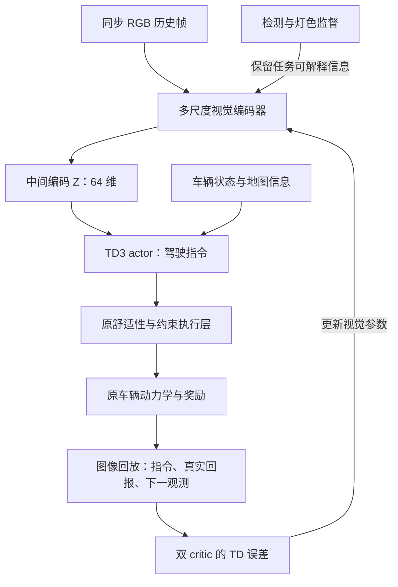

# TIV 视觉编码 Z 与 TD3 双向学习：代码框架及交接设计 v1

本方案基于 v19 的真实接口设计。目标是让摄像头图像进入 TD3，并让车辆实际执行所产生的回报反过来训练视觉表示。保留现有动力学、任务奖励、加速度定义、双 critic、延迟 actor 更新和舒适性执行公式。新增内容放在独立目录，先在 4 km 场景验证；本文件不是新的论文结果，也没有启动视觉训练。

## 1. 核心结构

图像网络先学习“画面中有什么”，再通过控制任务学习“其中哪些信息对驾驶有用”。两种学习同时保留，不能只靠累计奖励学习识别小目标。



这不是把不可微的车辆环境接进计算图。一次实际执行得到奖励和后继图像后，critic 判断“从这段图像出发、发出这个指令，收益预测是否准确”；其误差沿 `Q → Z → encoder` 反传。actor 仍经 `Q(s, actor(s))` 的动作梯度更新，但本方案先阻止 actor 梯度直接更新编码器，以减少两个目标同时拉扯视觉特征。critic 反馈已经满足“RL 校正图像编码”的要求。

## 2. v19 接口审计与最小改动

已读取：`TIV_comfort_v1/code/study.py`、`env20.py`，以及 `TIV_comfort_v2/code/curve_layer.py`。原 actor 是 13→64→64→1，双 critic 各为 14→64→64→1，动作归一化范围为 [-1,1]；正向乘 2.6、负向乘 3.5 转为 m/s²。短场景原更新周期为每 4 个 0.5 s 子步一次决策，n-step 为 20 个决策，gamma=1。舒适性正则使用真实上一加速度 `3.5 * obs[:,1]`。环境没有现成 RGB 摄像头入口，也没有行人/障碍物碰撞任务。

| 原组件 | 本次处理 |
|---|---|
| 动力学、电池功率、奖励、截止条件 | 原样保留并记录来源哈希 |
| actor/critic 两层 64 维主体、动作映射 | 保留，仅扩展输入层 |
| 双 Q、目标动作噪声、延迟更新、Polyak 更新 | 保留；增加目标视觉编码器 |
| 已有舒适性及停车可行性公式 | 保留；首阶段固定其信息条件 |
| 原 `obs()` 返回 13 维 | 不改函数；新 adapter 在外部清理视觉真值通道 |
| 回放池 | 仍保存同一控制转移，增加原始图像引用、采集时刻、可见性、执行轨迹引用 |
| checkpoint | 保留已有全状态思路，增加编码器、其优化器、相机与图像索引状态 |

“其余结构不变”不能意味着输入层、回放和 checkpoint 一行不动；这些是接入可训练图像编码必需的接口变化。本次不同时换 RL 算法、奖励、长程截止条件或平滑器。

## 3. 信息来源：哪些可以进 actor

主验证模式建议为 **camera + map**：灯色从图像编码 Z 提供，道路几何从声明可用的地图提供，车速等来自车辆传感器。它不是纯摄像头驾驶。

| 原下标 | 含义 | camera + map 模式 |
|---|---|---|
| 0 | 车速 | 保留 |
| 1 | 上一实际加速度 | 保留；舒适性正则依赖它 |
| 2 | 剩余路程 | 地图/定位，保留 |
| 3–5 | 当前限速、前方弯道距离及弯道限速 | 地图，保留 |
| 6 | 前方信号位置距离 | 地图，保留；不能称为视觉测距 |
| 7 | 仿真真值绿灯标记 | adapter 固定为原未知值 -1；信息通过 Z 进入 |
| 8 | 仿真精确倒计时 | adapter 固定为原未知占位 1，同时 V2X-valid=0 |
| 9–10 | SOC、电池温度 | 保留 |
| 11–12 | 真实剩余任务预算、当前时间 | 保留，不重引入旧的截止时间不可观测问题 |

准确倒计时不能从单帧普通灯面凭空得到。若日后加入合法 V2X，使用独立命名的 `camera_map_v2x` 模式，显式记录 valid、时间戳和来源；比较组必须同等获得 V2X。RGB 识别、地图距离、V2X 倒计时各自承担不同功能。

当前时间、路线和场景背景也可能成为记忆信号相位的捷径。数据必须跨 episode、相位偏移、灯具外观、背景划分；设计“同一路段/时间、改变可见灯色”的可行反事实核验。不能只屏蔽两个通道就宣布彻底消除了信息泄漏。

### 执行层仍用真值时，结论应怎样写

首阶段为满足“其余代码结构不变”，固定原执行器及其已披露的地图/信号访问能力，三组完全相同。此时验证对象是“固定守护器条件下的图像输入 TD3 及其表示学习”；实际零闯红可能来自守护器，不能据此称视觉已经解决安全驾驶。必须同时报告干预次数、原始指令及实际动作。

部署到真实摄像头的后续步骤，应把执行器的信息读取接到带置信度和时间戳的 `PerceivedScene` 接口，再核验 unknown/stale 时的处理。这需要单独协议；本次不悄悄把原执行器的真值访问改成视觉访问，否则同时改变两个实验因素。

## 4. 图像网络与 Z

候选输入为 RGB 640×384、10 Hz、连续 4 帧（当前帧及前三帧，约 0.3 s 历史）。这是资源评估起点，不是已经达到的实时指标。原 TD3 决策周期和执行子步保持不变；摄像头较高采样率提供历史帧，不等于把原策略更新频率提升到 10 Hz。

建议最终视觉前端使用轻量预训练骨干及 P2/P3/P4 多尺度特征。P2 保留 1/4 分辨率以处理小灯和小目标；高层特征提供道路场景。第一版不加入 ToMe，避免在尚未验证时通过 token 合并损失细节。

本包的 `VisualEncoder` 是**可运行的深度可分离卷积 + FPN 接口原型，随机初始化，无预训练权重**，并非已经训练好的 MobileNetV3 或生产检测器。交接方先验证接口，再选择有明确来源的预训练轻量骨干，保持输出契约。MobileNetV3 和 FPN 是已有设计来源，不认领为新增算法。

编码路径如下：

1. 每帧产生 P2/P3/P4 特征；P2 接检测中心热图和框回归头。
2. P4 池化形成 32 维场景特征；P2 通过可微事件权重形成 32 维事件特征。
3. 将每帧的 64 维特征、有效性和帧龄按时间顺序输入小型融合层，输出 64 维 Z。
4. TD3 实际输入为 `[清理后的原13维, Z64, 元信息4维]`，共 **81 维**。元信息为最新帧有效性、帧龄、控制灯关联有效性、V2X 有效性。critic 再拼原归一化指令，输入 **82 维**。

不在 RL 梯度路径使用硬 top-k、argmax 或 NMS；这些可在检测评估输出端使用。否则容易出现“检测框接进去了，但 RL 误差回不到检测网络”的假闭环。高分辨率和可微池化只是保留信息的设计，不能保证每个小目标一定保留下来。

### 小目标与控制灯关联

检测类别的原型为 traffic light、pedestrian、vehicle、cyclist、cone、other obstacle、stop line、sign。实际类别需按可获得标注冻结。框回归标签为正中心位置的归一化 l/t/r/b，交接方实现完整 target encoder、解码与评估。

灯色另设 red/yellow/green/off/unknown 五类。路口有多个灯时，必须先确定哪个灯控制本车路线；不能把任意一个绿灯当成本车绿灯。本包提供 `signal_roi` 与 `association_valid` 接口；推理 ROI 可来自地图灯具位置及相机标定投影，不能来自测试真值框。训练时使用真值框监督检测器属于正常监督，但不能把它偷偷送进部署输入。

低于可分辨像素尺寸、遮挡、过曝或关联失败应记录 unknown。建议按输入图像中目标高度 `<4、4–8、8–16、≥16 px` 报告召回与灯色混淆，不能用整体 mAP 掩盖远处小灯漏检。不要灰度化或任意 hue jitter；几何增强必须同步更新框、投影 ROI 和可见性。没有可观测数字显示或外部消息时，不训练“精确倒计时识别”。

### 时间与部分可观测性

每张图带 capture time；构造观测只用决策时刻以前的帧。补齐历史使用 invalid mask，不能从下一 episode 补帧。四帧历史只是轻量时序近似，并不证明图像观测满足马尔可夫性。灯相位持续时间等隐藏信息仍需明确其可观测范围。

## 5. RL 怎样反向训练视觉

令 `x_t=[o_t^clean,Z_t,m_t]`，`Z_t=f_phi(I_{t-3:t})`。回放中的动作始终是 actor 发给执行器的归一化指令 `u_t`；真实执行轨迹单独保存。已有投影器是环境转移的一部分，不能用投影后的加速度替换 replay 的动作字段，却继续训练 `Q(x,actor(x))`。

沿用现有 n-step 口径，collector 提供：

```math
y_t = R_t^{(n)} + b_t \min_{i=1,2} Q_{\bar\theta_i}\left(x'_{\bar\phi},\mathrm{clip}(\pi_{\bar\omega}(x'_{\bar\phi})+\epsilon)\right),
\qquad b_t=(1-\mathrm{terminal})\gamma^{n_{\mathrm{actual}}}.
```

目标分支在 `no_grad` 中，使用目标编码器和目标 actor/critic。真实任务截止是原目标的一部分，按终止处理；仅工程性的采集暂停不应冒充任务失败。保留原 n-step 未作重要性修正的已知限制，不声称图像接入修好了它。

```math
L_Q=\sum_i (Q_{\theta_i}(x_t,u_t)-y_t)^2,
\qquad
L_\phi=\lambda_Q L_Q+\lambda_{vis}(L_{det}+L_{box}+L_{signal}).
```

联合组 `lambda_Q=1`；仅监督组对 critic 输入 `detach`，但继续更新检测监督；冻结组完全冻结编码器。`lambda_vis=1`、encoder lr=1e-5 只是初始化建议，须在开发阶段核对损失尺度与梯度尺度，冻结后进入比较。不能用小验证集不断挑最好结果。

actor 目标继续使用原 `-Q1(x, actor(x)) + lambda_c * comfort_loss`。actor 更新时 `Z.detach()`，冻结 critic 参数但保留 Q 对动作的导数；没有把 actor 直接优化 Z 所带来的“骗高 Q”效应混进本轮。反馈并不意味着更高回报自动对应正确语义，也可能放大 critic 误差；检测监督与独立视觉评估用于检查这一点。

三种梯度关系由本包测试实际核验：joint 的 TD loss 能到 encoder；supervised/frozen 的 TD loss 不到 encoder；actor loss 不更新 encoder；目标编码器无梯度。新输入列若初始化为零，最初 TD 对 Z 的梯度可能为零，直到 critic 新列被训练；不能把第一步零梯度直接判成接口断开。

## 6. 旧权重、数据与恢复

输入扩展仅改第一层：旧 13 个状态列原样拷贝，新增 68 列初始化为零；critic 的旧动作列必须移到新输入最后一列。第二层和输出层不改。相同原 13 维输入时，这个扩展保留旧网络数值输出；但在线遮蔽灯色/倒计时后，输入已改变，**不承诺旧驾驶成绩保持不变**。

八种子旧日志无摄像头图像，不能伪装成视觉 replay。它们可以作为已有论文证据、状态基线和权重来源。若在原状态记录上事后生成图像，必须有可重建的姿态、相机、相位、遮挡和随机种子，并标明 reconstructed；它仍不等于新视觉策略的闭环轨迹。

回放保存原始 uint8 RGB 或可校验的无损帧引用，采样时重新编码。不能只保存 Z，因为 encoder 更新后旧 Z 与当前 Z 的含义可能不一致。推理时可以缓存同版本 encoder 的历史特征；发布新 encoder 版本时清空/重算缓存。训练回放一律从图像重编码。

本包 `FrameStore` 为逐文件 NPZ 原型；正式训练应采用不可变分片、去重索引及引用计数回收。引用包括 replay、未完成 n-step 队列、当前历史帧和 checkpoint；任何仍被引用的帧都不能删。125000 个旧数值转移不意味着可直接放进同样数量的 RGB 历史：一张 640×384 RGB 原图为 737280 bytes；50 万张约 368.64 GB，未计索引。10 Hz 下无损压缩比例必须实测，不能假定几 GB 就够。

原有效 batch=256 可能使视觉显存超限。先测 microbatch，用梯度累积维持相同有效 batch 和更新比例；本包 learner 是单 batch 接口，尚未实现生产级累积/AMP。若更改有效 batch、回放容量或更新比，所有比较臂同步修改并写入协议。

完整 checkpoint 要包含 encoder/target、actor/target、双 critic/target、全部 optimizer、学习率调度器、Python/NumPy/Torch/CUDA RNG、采样器顺序、探索噪声、完整 replay 和 n-step 队列、环境状态、相机时钟/历史帧/渲染随机状态、帧索引/分片落盘位置、全局步数与阶段状态。先落盘图像分片，再提交引用它们的 checkpoint；每 120 s 原子保存并保留上一份。恢复必须校验代码、配置、数据及协议身份，不能只载入 actor。

本包实现 checkpoint 信封和 learner 精确恢复测试；相机与物理环境必须由接入方提供真正可恢复的状态。外部 renderer 若不能逐步恢复，应明确 episode-boundary 恢复与可能重算的最大行程，不能仅因保存了字段名就宣称完全续跑。多 worker 数据加载和异步预取也需验证；先用单 worker 排除未保存顺序。

## 7. 摄像头数据如何接入原环境

推荐新增只读观察式渲染器：原环境仍计算车辆的 x/v/a、道路与灯相位；camera backend 用同一姿态与场景生成 RGB。不要同时启用另一个模拟器的动力学，否则奖励和物理对象一起变了。图像必须随策略动作而变化，不能给任意策略播放同一段录像。

若用外部 3D 引擎，车辆姿态由原环境驱动，灯状态使用同一绝对时刻；照明、外观、相机噪声及遮挡种子独立保存。仿真真值允许进入标签与环境裁判，不允许画成 HUD 文字/彩条/编码图案让 actor 读取，也不能通过样本 ID 进入神经网络。

旧环境无行人/障碍物动力学与碰撞奖励。因此第一阶段可以评估这些类别的视觉召回及鲁棒性，控制效果先验证红绿灯。要主张行人避碰，必须新增有交互和碰撞语义的任务；这超出“其余代码结构不变”，不能仅在画面贴一个行人就算验证了避碰。

## 8. 实验与预算：明确三组，避免归因混淆

| 配置 | 编码器是否更新 | TD 误差是否更新编码器 | 要回答的问题 |
|---|---|---|---|
| F：frozen | 否 | 否 | 预训练视觉接 RL 的基线 |
| S：supervised | 检测/灯色监督更新 | 否 | 仅继续视觉学习的效果 |
| J：joint | 同样监督 + TD 更新 | 是 | 额外控制反馈是否有增量 |

**主因果比较是 J 对 S。** 只比 J 对 F，会把“继续视觉训练”的效果错误归给 RL 反馈。三组从同一个预训练 encoder、经过共同短适配的 actor/critic 初始权重和离线视觉标注池出发，使用匹配环境种子及相同预算。在线动作会导致轨迹不同，不能声称三组 replay 完全一样；每步辅助监督尽量从共同离线标注池按相同采样计划取样，使 S/J 的监督曝光匹配。若直接监督各自在线帧，应明确结果同时包含闭环数据分布变化。本包 `TransitionBatch.visual_obs` 已提供独立监督 batch 接口，`labels` 与其对应；生产接入须用同一离线采样计划构建它。若不提供，则监督同一 RL 观测，仅用于接口测试或已披露的在线监督方案。

阶段顺序：

1. **指标/代码审计**：RGB 来源、标签、相机/动作时间戳、颜色通道、控制灯关联、真值隔离、动作字段、预算通道、帧 replay、梯度方向和恢复。
2. **10 分钟烟测**：在相机后端与标注可用后运行。验证完整采集—预处理—编码—actor—执行—回放—更新闭环；强制中断并恢复；报告吞吐、显存和文件增长。随机张量单测不算这项烟测。
3. **1 小时小规模**：一个匹配开发种子，三臂各约 15 分钟训练，剩余约 15 分钟共同评估/保存；公平比较按实测速率设相同转移与更新预算。先从同一合格视觉预训练状态分叉；若预训练尚未完成，这一小时用于建立该状态，不能冒充三臂验证已经完成。
4. **候选正式规模**：3 配置 × 3 个匹配训练种子。只有小规模能看见任务相关反馈、视觉识别不退化、无新增失控/超时风险且预算可承受时才冻结。步数、epoch、条件数、checkpoint 选择规则、置信区间和费用由实测决定。

不预先承诺精度或收益。正式预算报告写出每配置 substeps/decisions/updates、预训练 frames/epochs、训练/评估/保存分别耗时、峰值磁盘/显存、GPU 小时×实际租价。预计总时间按各臂实测速度求和，加上评估、保存和预训练；本次没有 GPU 租价或生产速度数据，不填虚构费用。

## 9. 验收指标

视觉：控制灯红→绿误判、green→red/unknown 分开，目标尺度分层召回、实际可见距离、控制灯关联错误、校准/unknown率、遮挡/昼夜/曝光子组。帧级标注指标与 route/episode 级置信区间分别报告，不能把相关视频帧当独立样本。

控制：完赛、红灯违反、执行层干预、实际 jerk 积分/RMS/峰值、制动强度、行程时间/能耗、原始指令与实际动作差。使用 v19 的实际加速度与实际时间步计算；失败路线单独列出，不能用提前失败的短轨迹美化积分代价。

双向学习：固定审计图像集上的 Z 漂移、方差、视觉识别变化，TD→encoder 梯度非零及有限，critic 预测误差；关键是 J 对 S 的独立控制评估。梯度非零、Q loss 下降或 Z 改变本身都不是性能提升证明。

实时：同时报告 GPU 推理 p50/p95/p99 和图像采集/排队/预处理/编码/actor/执行的端到端帧龄；CUDA 测时必须同步。10 Hz 的 100 ms 预算只是候选目标，不能用小分辨率 CPU 单测或只测 backbone 的速度宣称实时部署。记录迟到帧、丢帧与回退；在线学习使用另一份 learner，推理只在明确版本边界原子接收权重，清空编码缓存并保存版本号。骨架尚未实现异步双进程服务。

## 10. 交接包已实现与尚待接入

已实现：多尺度随机初始化视觉骨架、可微 Z、原观测清理、旧 actor/critic 第一层迁移、三组梯度路径、目标编码器、原舒适性损失、图像索引原型、全状态保存接口及测试。

尚待 Codex 完成：同步相机 renderer/真实采集接口；可见性与控制灯关联；数据集、检测 target 编码/解码/指标；预训练骨干加载；共享视觉监督池与匹配采样器；真实 collector+n-step+frame index 接入；分片/ref-count 清理、microbatch 和生产恢复；完整烟测、小规模及后续实验。没有将这些未完成部分包装成已训练网络。

先读 `CODEX_TASK.md`，然后在独立开发目录把接口接到 v19。不要修改冻结论文证据或覆盖旧运行目录。

## 参考实现与设计依据

- [TD3 原作者实现](https://github.com/sfujim/TD3/blob/master/TD3.py)：双 critic、延迟 actor 和动作梯度；本方案的视觉反馈路径属于新增设计。
- [Improving Sample Efficiency in Model-Free Reinforcement Learning from Images](https://arxiv.org/abs/1910.01741)：视觉表示与 actor/critic 学习的相关研究；本方案不声称其结论直接证明了本车任务有效。
- [Feature Pyramid Networks for Object Detection](https://arxiv.org/abs/1612.03144)：多尺度检测特征的依据。
- [Searching for MobileNetV3](https://arxiv.org/abs/1905.02244)：生产轻量骨干的候选依据；本包原型未采用其预训练权重。
